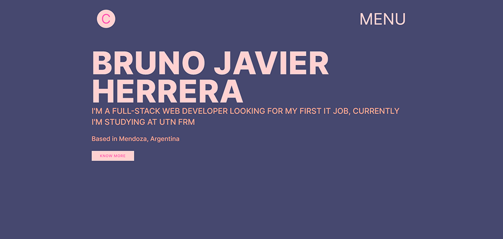
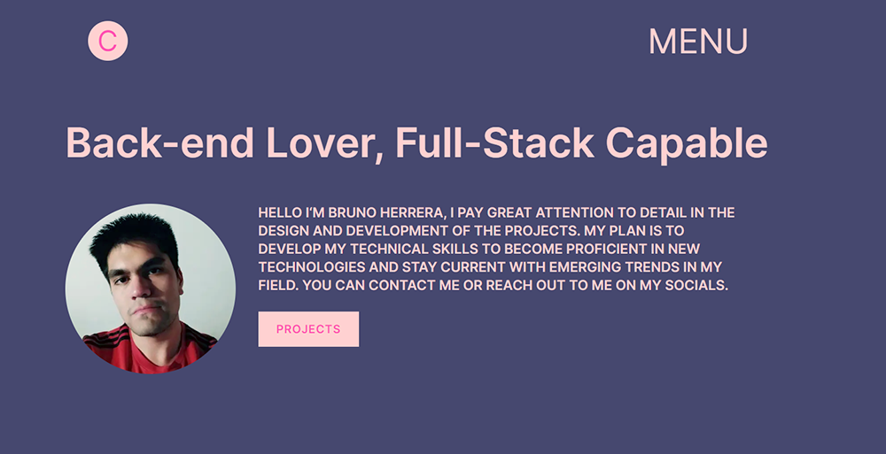
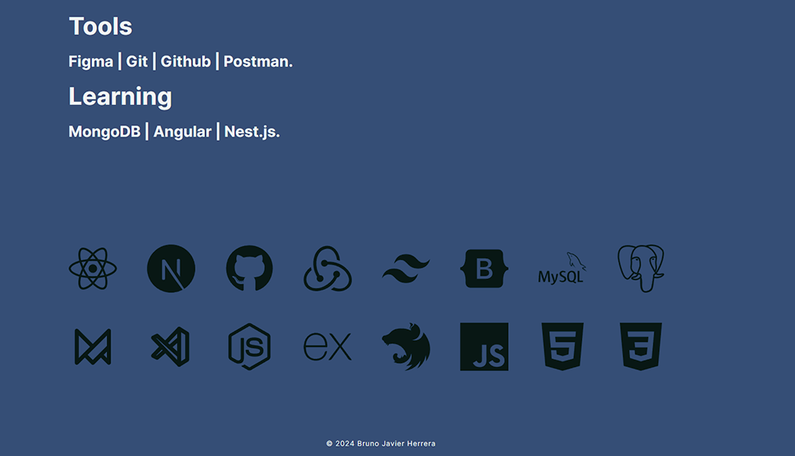
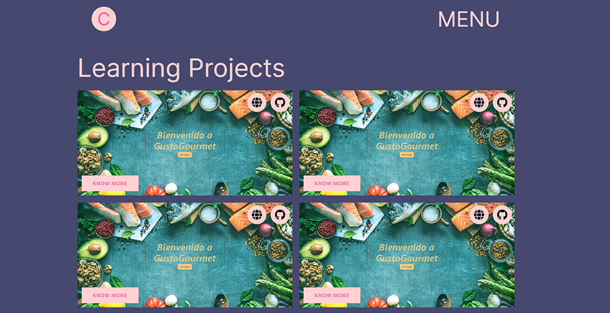
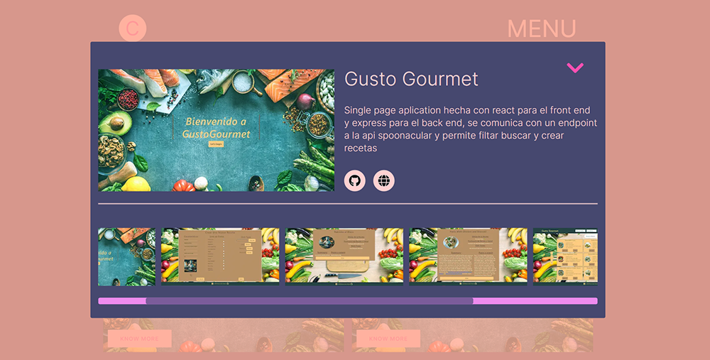
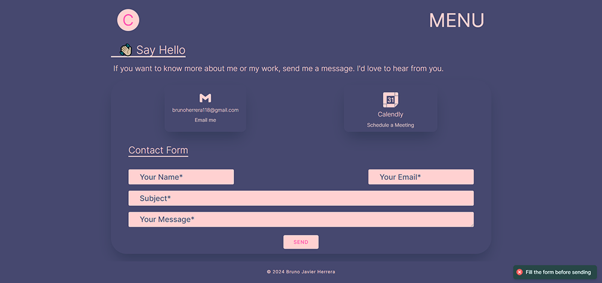

# **Portafolio Personal**

_Este es el repositorio de mi portafolio personal, desarrollado con Next.js 13 y Framer Motion para crear una experiencia interactiva y fluida. La aplicación también hace uso de React Hot Toast para notificaciones dinámicas y Node Mailer para el envío de correos electrónicos desde el formulario de contacto._

## **Características Principales**

_Next.js 13: Utilizado como framework de React para la construcción de la aplicación, ofreciendo renderizado del lado del servidor y optimización del rendimiento.
Framer Motion: Aprovechado para añadir animaciones suaves y elegantes, mejorando la experiencia del usuario.
React Hot Toast: Implementado para mostrar notificaciones emergentes de manera dinámica, como confirmaciones de envío de formularios.
Node Mailer: Integrado para gestionar el envío de correos electrónicos desde el formulario de contacto, facilitando la comunicación con los visitantes._

## **Instalación y Uso**

1. Clona este repositorio en tu máquina local.
2. Navega hasta el directorio del proyecto.
3. Instala las dependencias utilizando npm install.
4. Ejecuta la aplicación utilizando npm run dev.
5. Visita http://localhost:3000 en tu navegador para ver el portafolio en acción.

## **Contribución**

¡Las contribuciones son bienvenidas! Si deseas mejorar esta aplicación, no dudes en enviar un pull request. Asegúrate de seguir las guías de contribución y de código.

## **Problemas y Sugerencias**

_Si encuentras algún problema o tienes alguna sugerencia, por favor crea un issue en este repositorio. Estaré encantado de discutir y abordar cualquier problema que surja._

## **Licencia**

_Este proyecto está bajo la licencia MIT._

## **Imagenes**

